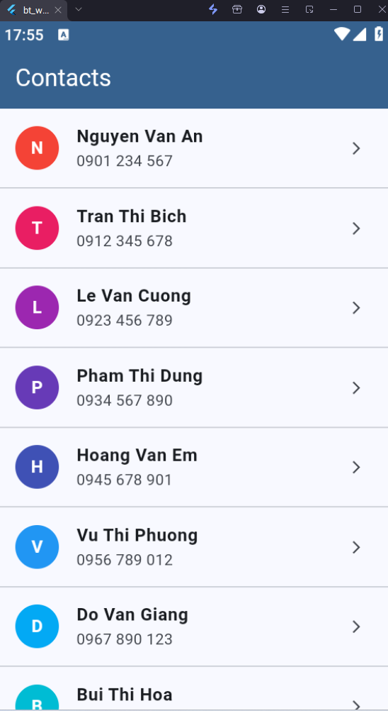
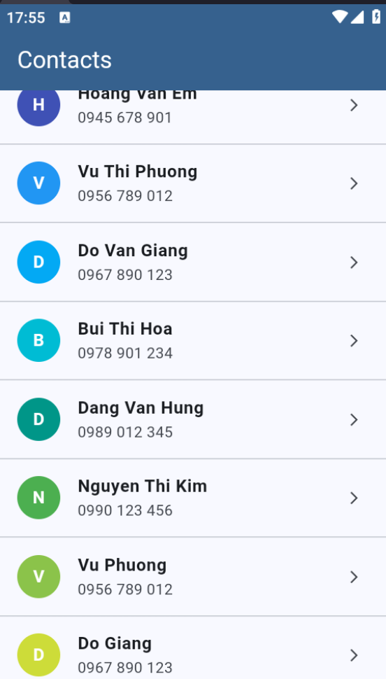

# Bài 1: List View

## Mô tả
Ứng dụng hiển thị danh sách contacts có thể scroll. Mỗi contact gồm avatar placeholder (chữ cái đầu + màu sắc), tên và số điện thoại. Nhấn vào từng contact sẽ hiện popup thông tin chi tiết.

## Tính năng
- Danh sách contacts có thể scroll
- Avatar placeholder với chữ cái đầu và màu ngẫu nhiên
- Hiển thị tên + số điện thoại
- Nhấn vào contact để xem thông tin chi tiết (popup)

## Hình ảnh
![Danh sách contacts]





![Popup chi tiết]


## Cách chạy
```bash
flutter pub get
flutter run
```
