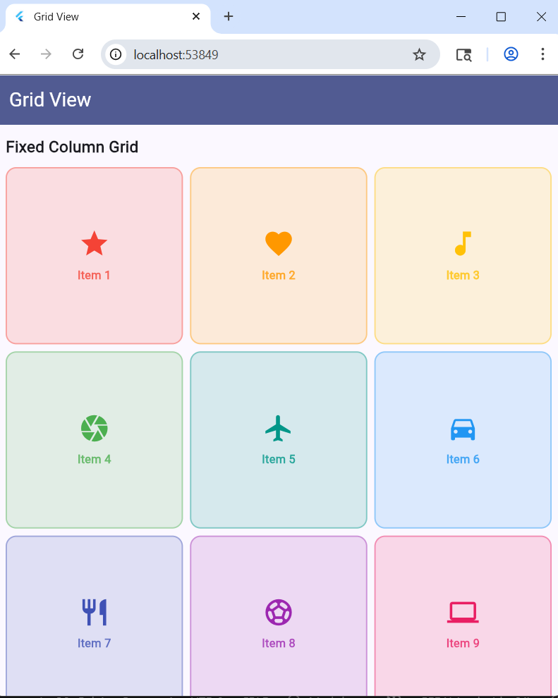
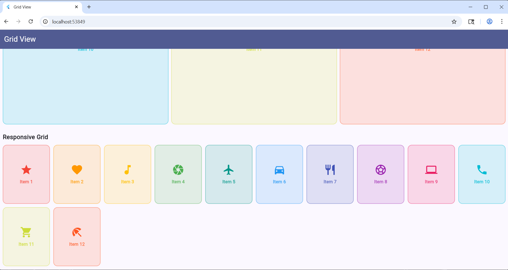

# Bài 2: Grid View

## Mô tả
Ứng dụng hiển thị gallery 12 items sử dụng 2 loại GridView khác nhau trong cùng một màn hình.

## Tính năng

### Section 1 — Fixed Column Grid (GridView.count)
- Số cột cố định: 3
- Khoảng cách hàng: 8
- Khoảng cách cột: 8
- Tỷ lệ khung hình: 1.0

### Section 2 — Responsive Grid (GridView.extent)
- Max cross-axis extent: 150
- Khoảng cách hàng: 10
- Khoảng cách cột: 10
- Tỷ lệ khung hình: 0.8

Mỗi item gồm: container bo góc + icon + label text.

## Hình ảnh
![Fixed Column Grid]



![Responsive Grid]



## Cách chạy
```bash
flutter pub get
flutter run
```
