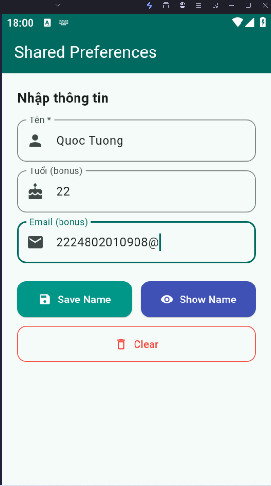
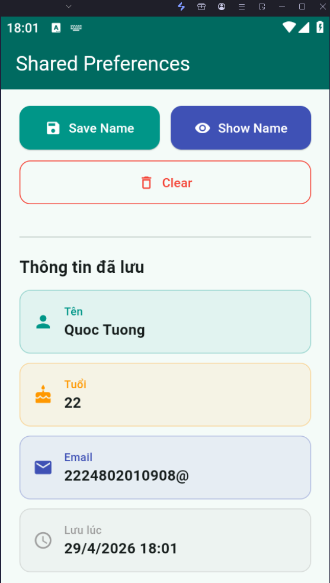

# Bài 3: Shared Preferences

## Mô tả
Ứng dụng lưu và đọc thông tin người dùng bằng SharedPreferences. Dữ liệu được giữ lại ngay cả khi đóng và mở lại app.

## Tính năng
- TextField nhập tên, tuổi, email
- Nút **Save Name**: lưu dữ liệu vào SharedPreferences
- Nút **Show Name**: đọc và hiển thị dữ liệu đã lưu
- Nút **Clear**: xóa toàn bộ dữ liệu đã lưu
- Hiển thị thời gian lưu lần cuối
- Xử lý trường hợp chưa có dữ liệu

## Hình ảnh
![Nhập thông tin]

![Hiển thị dữ liệu đã lưu]


## Cách chạy
```bash
flutter pub get
flutter run
```

## Package sử dụng
- `shared_preferences: ^2.2.2`