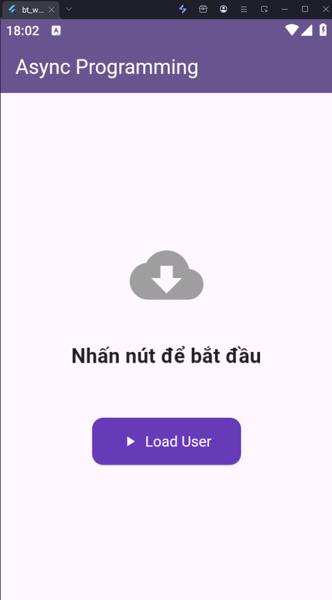
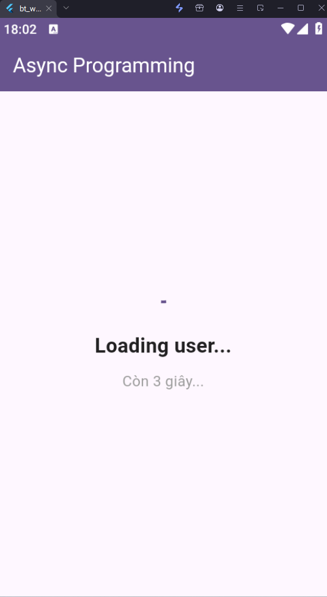
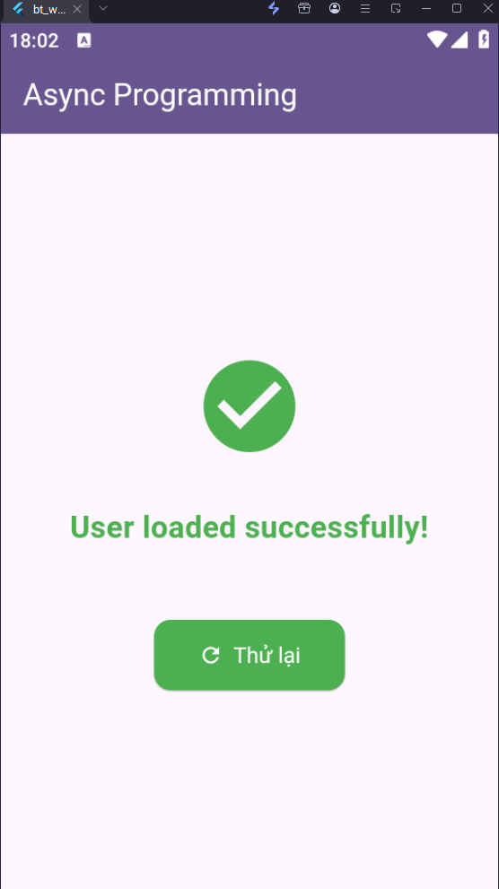

# Bài 4: Async Programming

## Mô tả
Ứng dụng minh họa lập trình bất đồng bộ (async/await) trong Flutter. App giả lập việc load dữ liệu người dùng với thời gian chờ 3 giây.

## Tính năng
- Hiển thị trạng thái "Loading user..." khi đang tải
- Vòng tròn loading + đếm ngược 3 giây
- Hiển thị "User loaded successfully!" sau khi tải xong
- Nút Thử lại để reset về trạng thái ban đầu

## Hình ảnh

![Trạng thái ban đầu]



![Đang loading]



![Load thành công]



## Cách chạy
```bash
flutter pub get
flutter run
```
