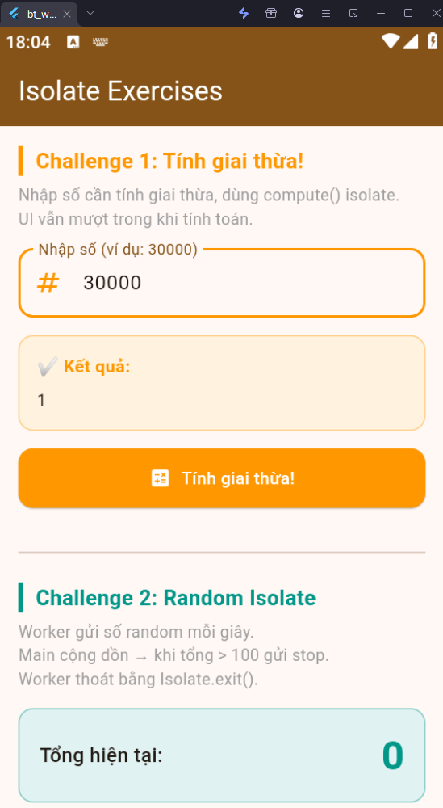
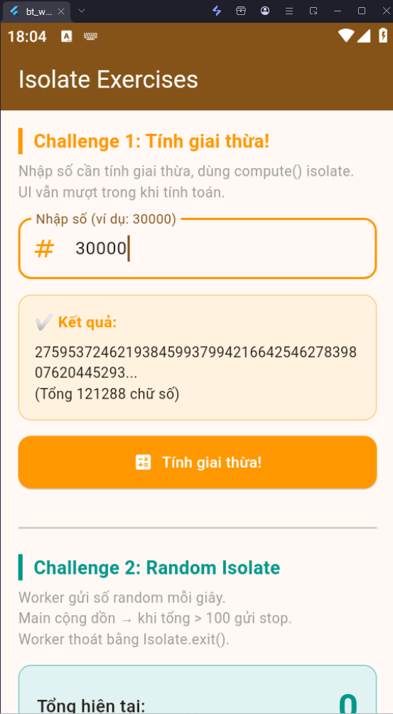
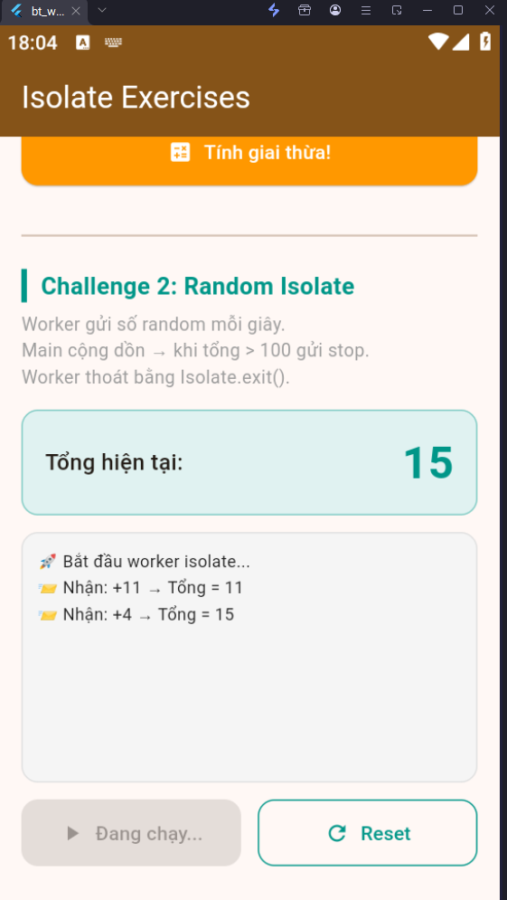
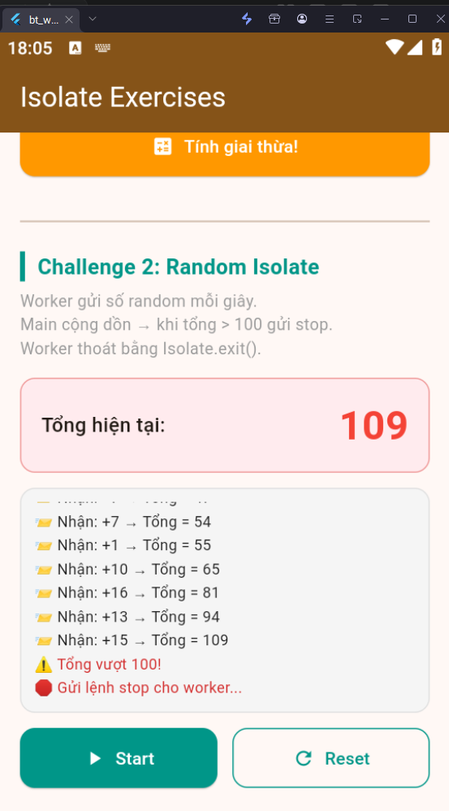

# Bài 5: Isolate

## Mô tả
Ứng dụng minh họa việc sử dụng Isolate trong Flutter/Dart để xử lý các tác vụ nặng mà không làm đơ UI.

## Tính năng

### Challenge 1 — Tính giai thừa
- Nhập số bất kỳ (ví dụ: 30000)
- Dùng `compute()` để tính giai thừa trong isolate riêng
- UI vẫn mượt mà trong khi tính toán
- Hiển thị kết quả + tổng số chữ số

### Challenge 2 — Random Number Isolate
- Spawn worker isolate bằng `Isolate.spawn()`
- Worker gửi số random (1-20) mỗi giây về main isolate
- Main isolate cộng dồn và hiển thị log realtime
- Khi tổng > 100, main gửi lệnh **stop**
- Worker thoát gracefully bằng `Isolate.exit()`

## Hình ảnh
![Challenge 1 - Nhập số]

![Challenge 1 - Kết quả]

![Challenge 2 - Đang chạy]

![Challenge 2 - Đã dừng]

## Cách chạy
```bash
flutter pub get
flutter run
```