# Weather App - Lab 4

<div align="center">

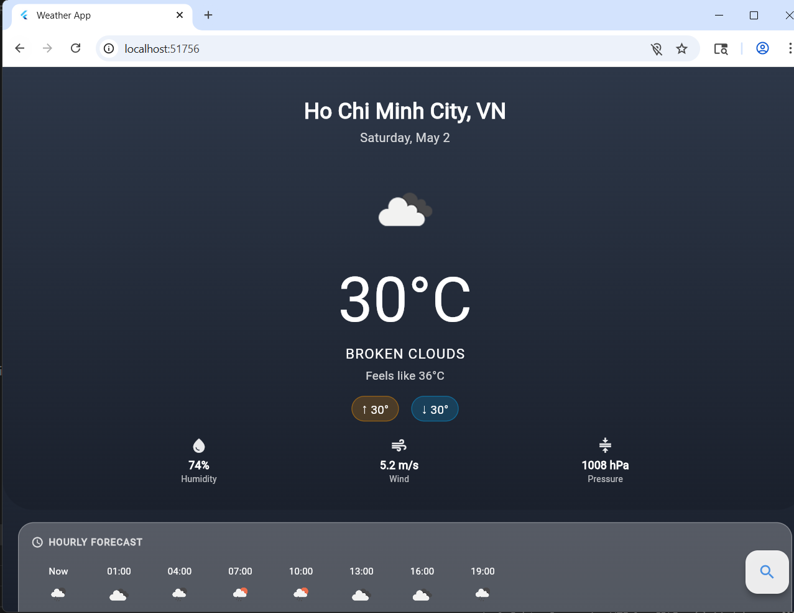

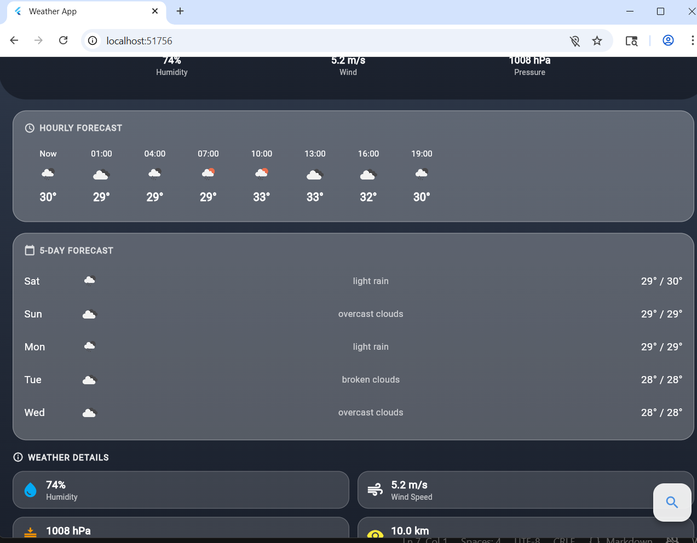

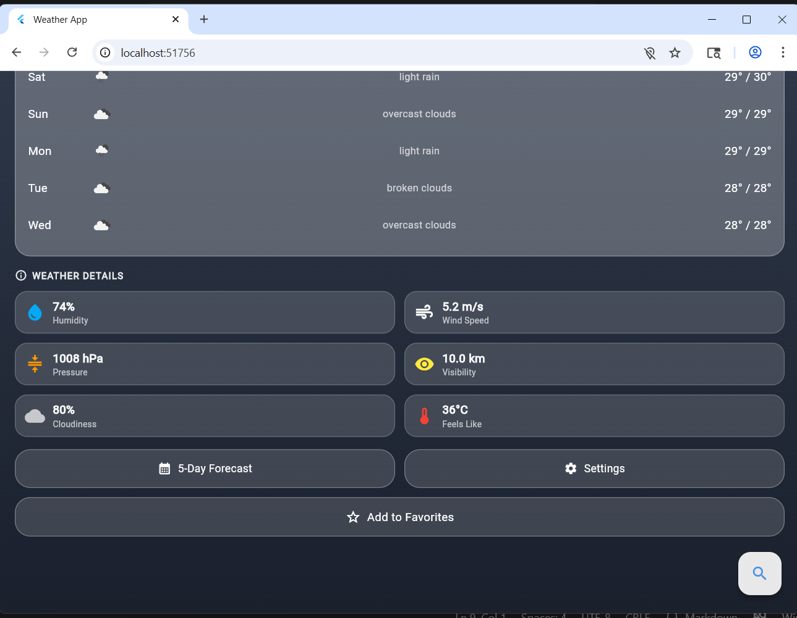

</div>

---

##
| **Student Name** | Nguyễn Quốc Tường |
| **Student ID** | 2224802010908 |
| **Course** | Phát triển ứng dụng đa nền tảng |
| **University** | Đại học Thủ Dầu Một |
| **GitHub** | [QuocTuongM](https://github.com/QuocTuongM) |

---

## 📱 Screenshots

###  Home Screen - Current Weather


###  Search Screen

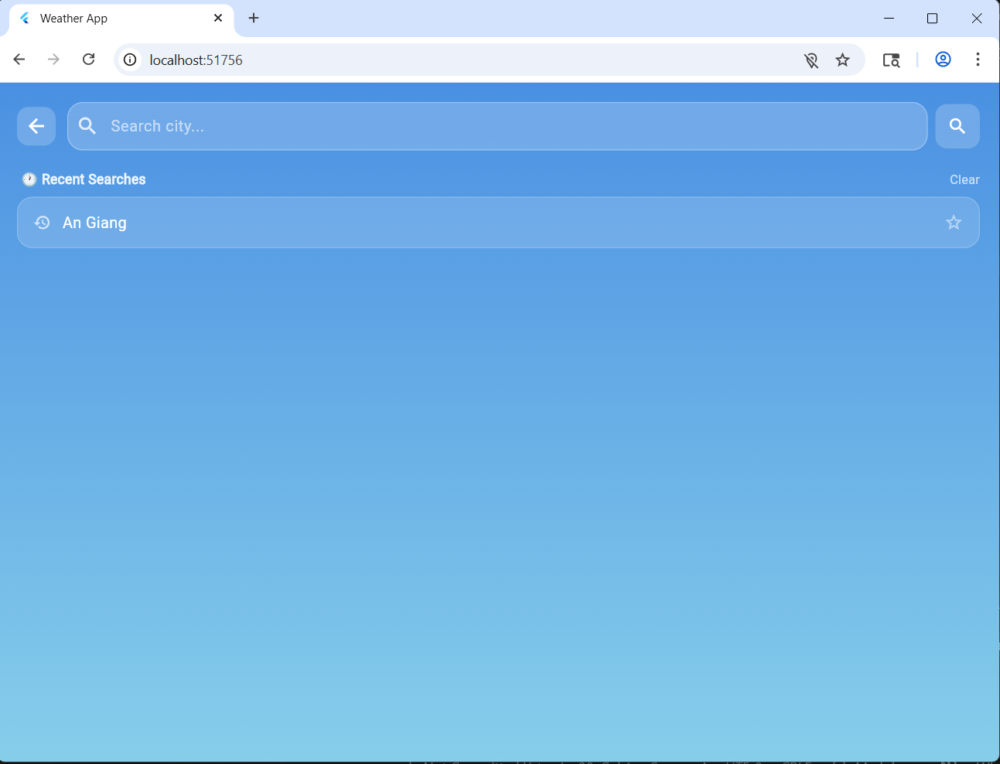

###  5-Day Forecast

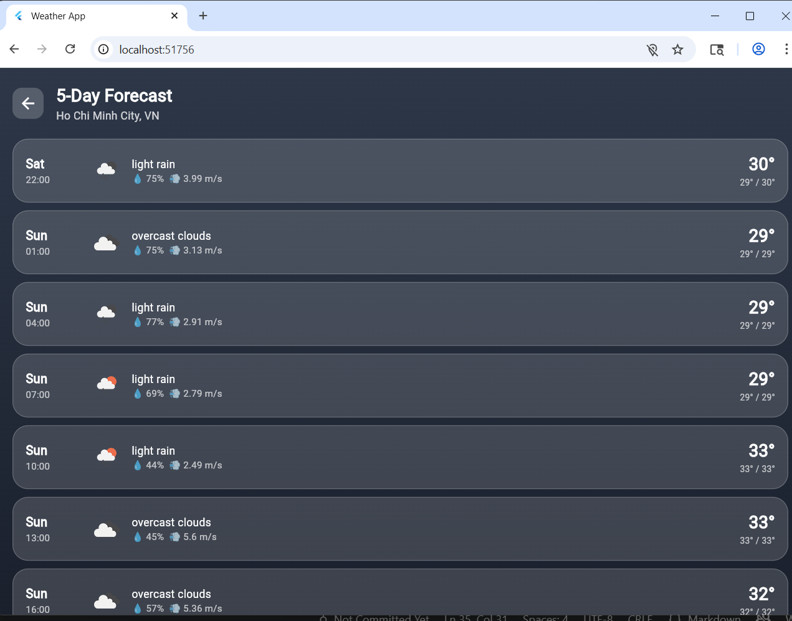

###  Settings Screen

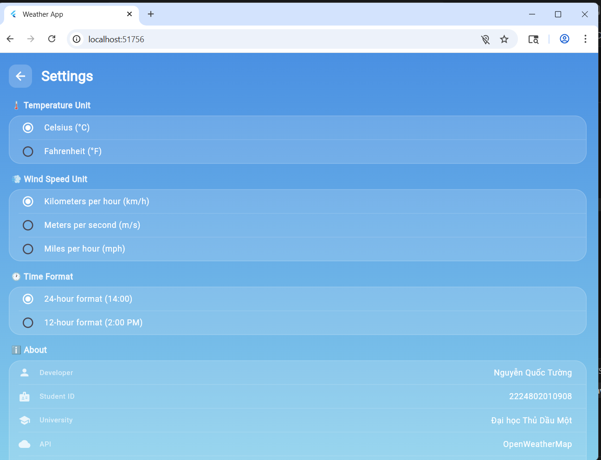

###  Favorite Cities

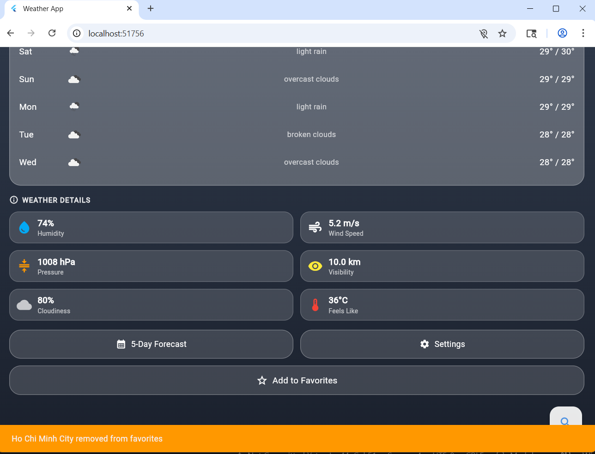

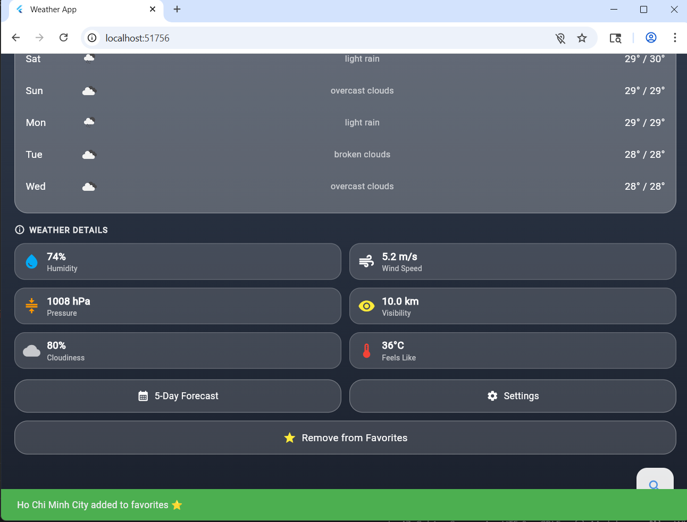

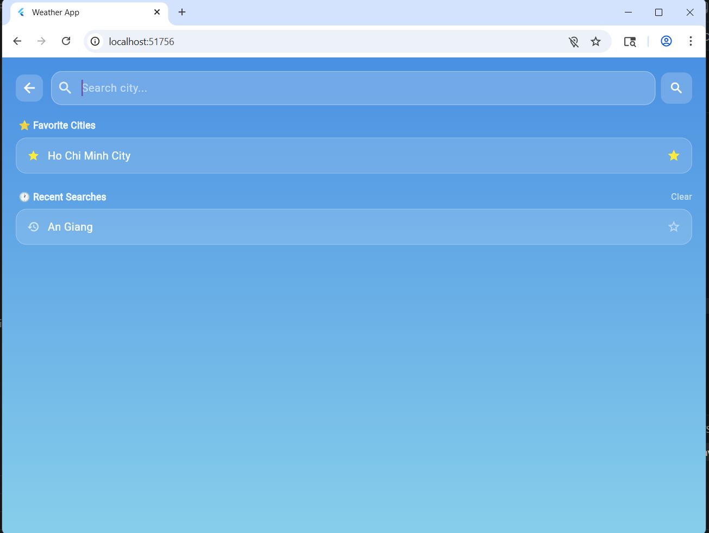

###  Offline Mode
<!-- 📸 CHỤP: Tắt WiFi trên LDPlayer, mở app, chụp màn hình offline (có badge cam "Offline") -->

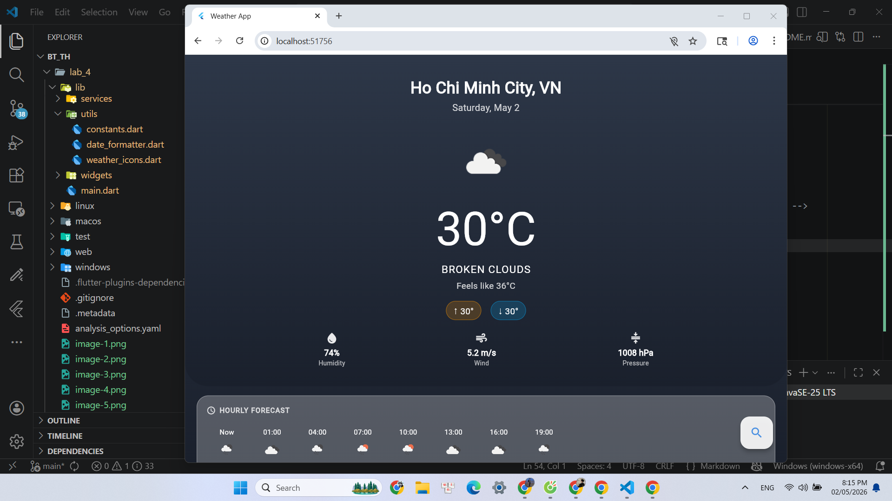

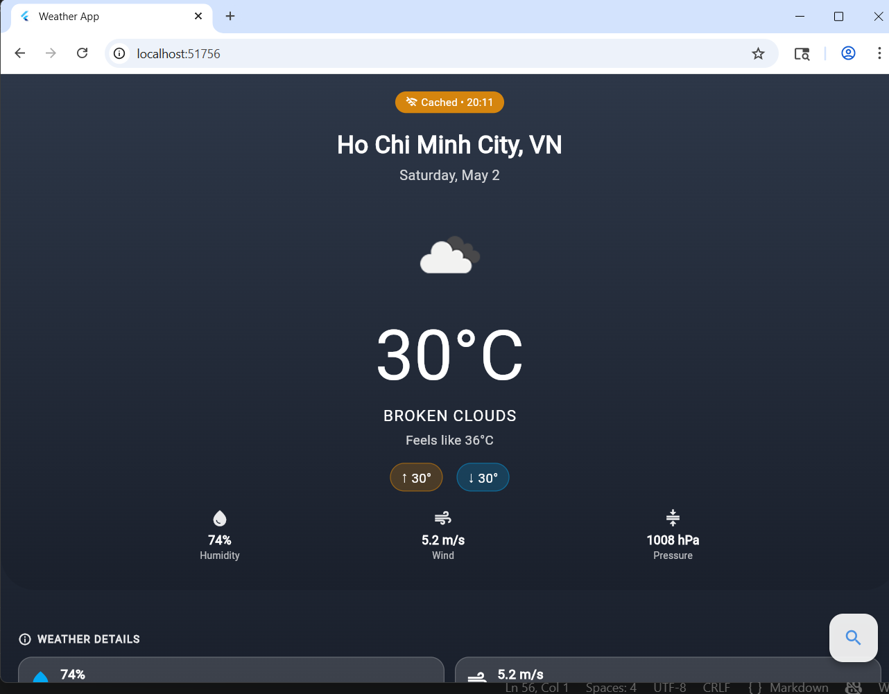

### ⏳ Loading State

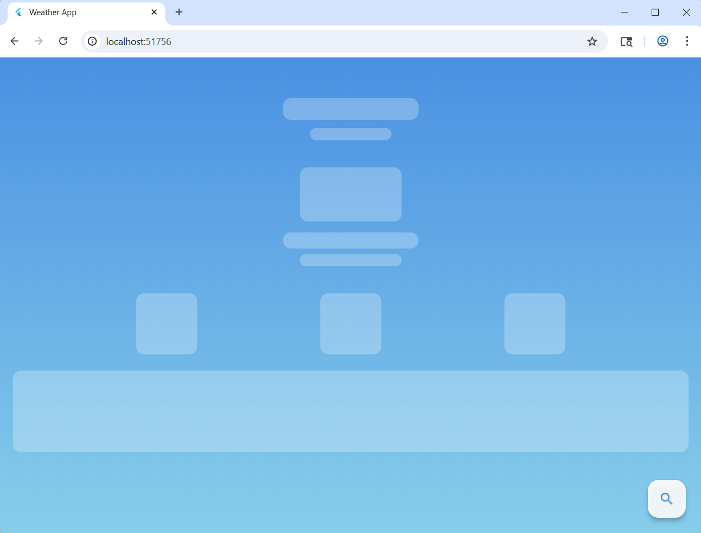

## ✨ Features

### Core Features
-  **Current Weather** - Nhiệt độ, cảm giác như, độ ẩm, gió, áp suất
-  **Auto Location** - Tự động lấy thời tiết theo vị trí GPS
-  **City Search** - Tìm kiếm thời tiết bất kỳ thành phố nào
-  **5-Day Forecast** - Dự báo 5 ngày tiếp theo
-  **Hourly Forecast** - Dự báo 24 giờ tiếp theo
-  **Weather Details** - Tầm nhìn, độ che phủ mây, áp suất, độ ẩm

### Advanced Features
-  **Favorite Cities** - Lưu tối đa 5 thành phố yêu thích
-  **Recent Searches** - Truy cập nhanh các tìm kiếm gần đây
-  **Offline Cache** - Xem dữ liệu cuối khi không có internet
-  **Pull to Refresh** - Kéo xuống để cập nhật thời tiết
-  **Dynamic Themes** - Nền thay đổi theo điều kiện thời tiết
-  **Settings** - Đơn vị nhiệt độ, tốc độ gió, định dạng giờ

---

## Cấu trúc Project

```
lib/
├── main.dart                        # Entry point, Provider setup
├── config/
│   └── api_config.dart              # API key & endpoints
├── models/
│   ├── weather_model.dart           # Model thời tiết hiện tại
│   ├── forecast_model.dart          # Model dự báo 5 ngày
│   ├── hourly_weather_model.dart    # Model dự báo theo giờ
│   └── location_model.dart          # Model vị trí
├── services/
│   ├── weather_service.dart         # Gọi API OpenWeatherMap
│   ├── location_service.dart        # GPS & geocoding
│   ├── storage_service.dart         # Cache với SharedPreferences
│   └── connectivity_service.dart    # Kiểm tra kết nối mạng
├── providers/
│   ├── weather_provider.dart        # State management thời tiết
│   └── location_provider.dart       # State management vị trí
├── screens/
│   ├── home_screen.dart             # Màn hình chính
│   ├── search_screen.dart           # Màn hình tìm kiếm
│   ├── forecast_screen.dart         # Màn hình dự báo 5 ngày
│   └── settings_screen.dart         # Màn hình cài đặt
├── widgets/
│   ├── current_weather_card.dart    # Card thời tiết hiện tại
│   ├── hourly_forecast_list.dart    # Danh sách dự báo theo giờ
│   ├── daily_forecast_card.dart     # Card dự báo hàng ngày
│   ├── weather_detail_item.dart     # Item chi tiết thời tiết
│   ├── loading_shimmer.dart         # Animation loading
│   └── error_widget.dart            # Widget hiển thị lỗi
└── utils/
    ├── constants.dart               # Màu sắc & chuỗi
    ├── weather_icons.dart           # Icons & gradient theo thời tiết
    └── date_formatter.dart          # Format ngày giờ
```

---

## 🛠️ Technologies Used

| Package | Version | Purpose |
|---|---|---|
| `flutter` | SDK | UI Framework |
| `provider` | ^6.1.1 | State Management |
| `http` | ^1.1.0 | Gọi API HTTP |
| `geolocator` | ^10.1.0 | Lấy vị trí GPS |
| `geocoding` | ^2.1.1 | Tọa độ → Tên thành phố |
| `shared_preferences` | ^2.2.2 | Cache dữ liệu local |
| `cached_network_image` | ^3.3.0 | Cache icon thời tiết |
| `connectivity_plus` | ^5.0.2 | Kiểm tra kết nối mạng |
| `intl` | ^0.18.1 | Format ngày giờ |

---

##  API Setup

App sử dụng **OpenWeatherMap API** (Free tier: 1,000 calls/day).

### Cách lấy API key:
1. Truy cập [https://openweathermap.org/api](https://openweathermap.org/api)
2. Đăng ký tài khoản miễn phí
3. Verify email
4. Vào tab **API keys**
5. Copy API key mặc định

## Cách chạy

```bash
# 1. Clone repository
git clone https://github.com/QuocTuongM/TH_Flutter.git

# 2. Vào thư mục lab_4
cd TH_Flutter/lab_4

# 3. Cài dependencies
flutter pub get

# 4. Chạy app
flutter run
```
---

##  Future Improvements

- Animation thời tiết (mưa, tuyết, nắng)
- So sánh nhiều thành phố
- Thông báo thời tiết
- Air Quality Index (AQI)
- Widget màn hình chính Android
- Hỗ trợ đa ngôn ngữ

---

<div align="center">
</div>