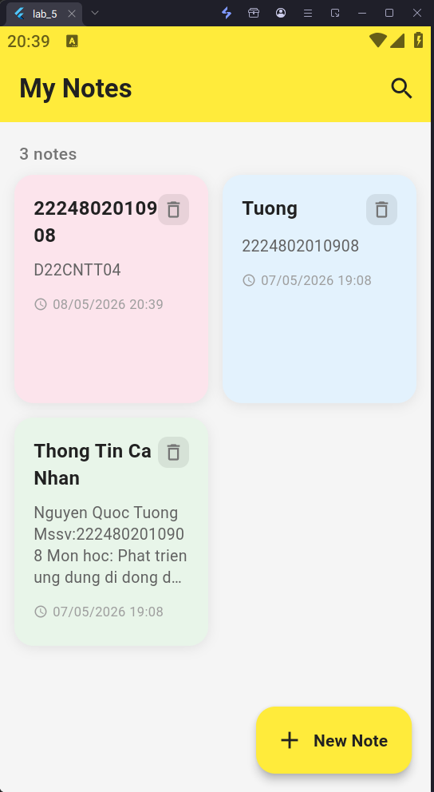
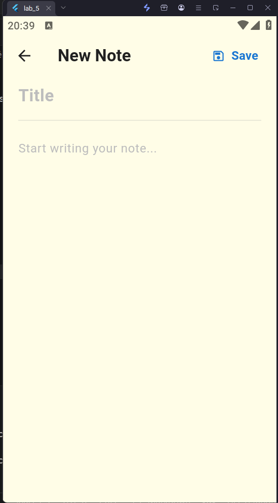
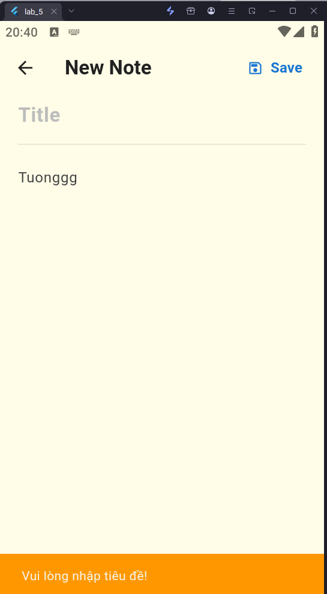
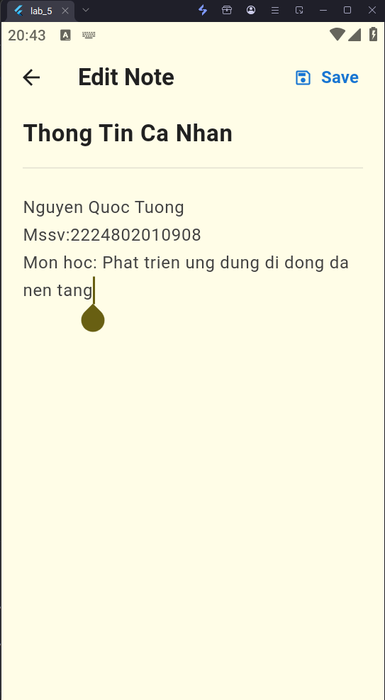
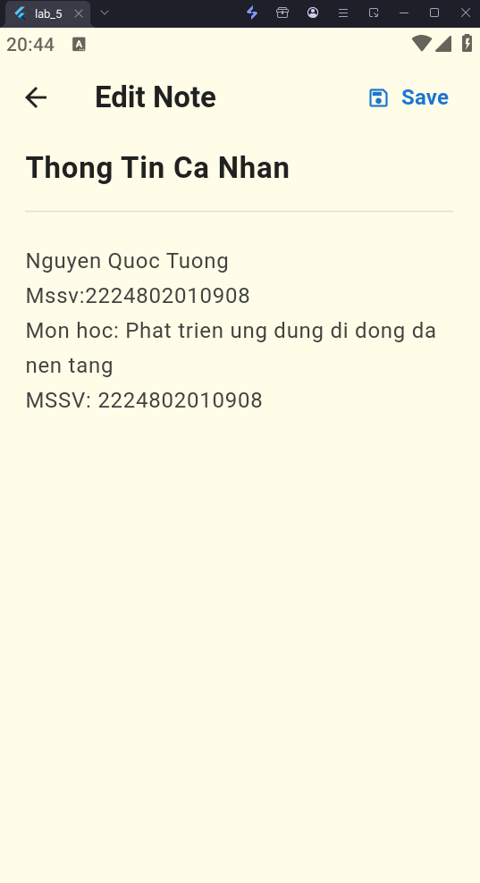
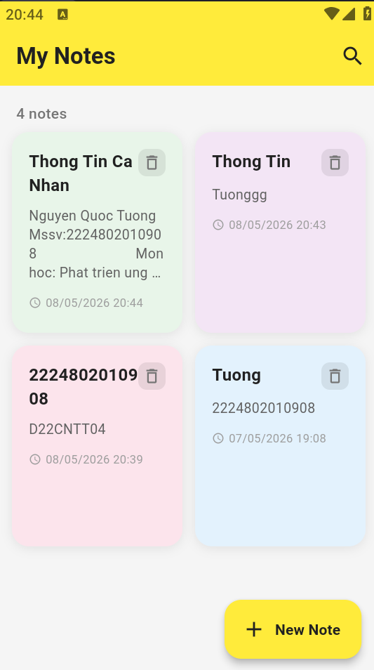

# 📝 Lab 5 - Simple Note App

Ứng dụng ghi chú đơn giản được xây dựng bằng Flutter, sử dụng SQLite để lưu trữ dữ liệu cục bộ.
---

## 📸 Giao diện ứng dụng


Trang chủ



New Note



Không nhập tiêu đề



Nhập thông tin mà chưa bấm lưu


Chỉnh sửa thông tin đã lưu







---

##  Tính năng

-  Tạo ghi chú với tiêu đề và nội dung
-  Xem danh sách ghi chú dạng lưới (grid) có thể cuộn
-  Chỉnh sửa ghi chú đã có
-  Xóa ghi chú với hộp thoại xác nhận
-  Tìm kiếm ghi chú theo tiêu đề hoặc nội dung
-  Lưu dữ liệu cục bộ bằng SQLite
-  Hiển thị thời gian tạo/cập nhật ghi chú
-  Cảnh báo khi thoát mà chưa lưu

---

##  Công nghệ sử dụng

| Package | Phiên bản | Mục đích |
|---|---|---|
| `sqflite` | ^2.3.0 | Lưu trữ dữ liệu SQLite |
| `path_provider` | ^2.1.0 | Lấy đường dẫn lưu file |
| `provider` | ^6.1.0 | Quản lý state |
| `intl` | ^0.18.0 | Format ngày giờ |

---

##  Cấu trúc thư mục
lab_5/
├── lib/
│   ├── models/
│   │   └── note.dart              # Model dữ liệu ghi chú
│   ├── database/
│   │   └── db_helper.dart         # Xử lý SQLite (CRUD)
│   ├── providers/
│   │   └── note_provider.dart     # Quản lý state với Provider
│   ├── screens/
│   │   ├── home_page.dart         # Màn hình danh sách ghi chú
│   │   └── note_editor_screen.dart # Màn hình tạo/chỉnh sửa
│   ├── widgets/
│   │   └── note_card.dart         # Widget card hiển thị ghi chú
│   └── main.dart                  # Điểm khởi chạy ứng dụng
├── screenshots/                   # Ảnh chụp màn hình
├── pubspec.yaml
└── README.md
---

## 🚀 Hướng dẫn cài đặt & chạy

### Yêu cầu

- Flutter SDK >= 3.x
- Android Emulator hoặc thiết bị thật (Android/iOS)

### Các bước thực hiện

```bash
# 1. Clone repository
git clone https://github.com/QuocTuongM/TH_Flutter.git
cd TH_Flutter/lab_5

# 2. Cài đặt dependencies
flutter pub get

# 3. Chạy ứng dụng
flutter run
```

---

## 🗄️ Cơ sở dữ liệu

Ứng dụng sử dụng SQLite với bảng `notes` có cấu trúc:

| Cột | Kiểu | Mô tả |
|---|---|---|
| `id` | INTEGER (PK) | Khóa chính, tự tăng |
| `title` | TEXT | Tiêu đề ghi chú |
| `content` | TEXT | Nội dung ghi chú |
| `createdAt` | TEXT | Thời gian tạo (ISO 8601) |
| `updatedAt` | TEXT | Thời gian cập nhật (ISO 8601) |

---

## 📖 Hướng dẫn sử dụng

1. **Tạo ghi chú mới:** Nhấn nút **"+ New Note"** ở góc dưới bên phải
2. **Xem/Chỉnh sửa ghi chú:** Nhấn vào card ghi chú bất kỳ
3. **Xóa ghi chú:** Nhấn icon trên card, xác nhận trong hộp thoại
4. **Tìm kiếm:** Nhấn icon trên thanh tiêu đề, nhập từ khóa
5. **Lưu ghi chú:** Nhấn nút **"Save"** trên thanh trên cùng

---
