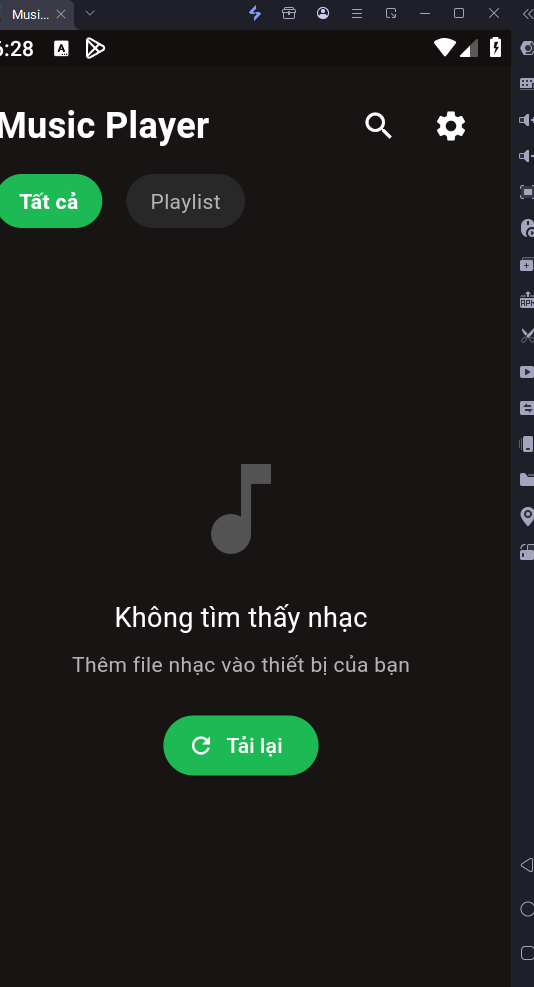
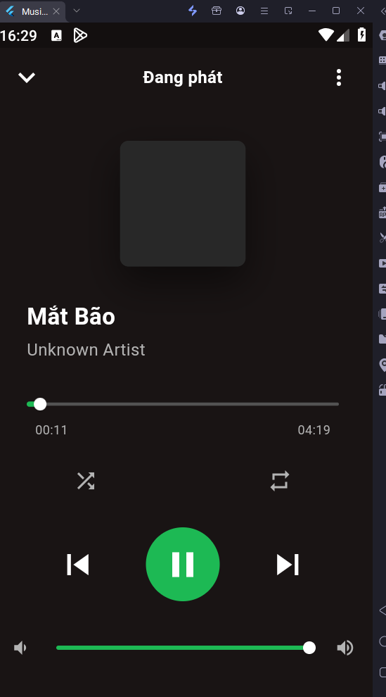
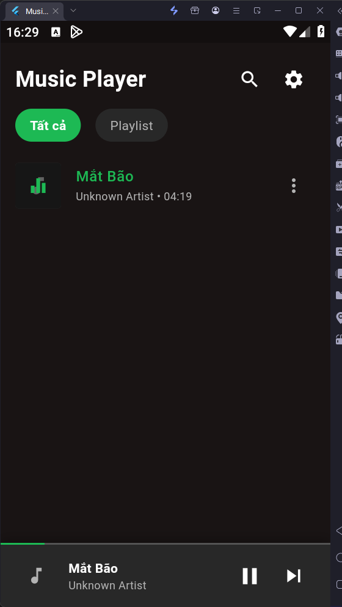
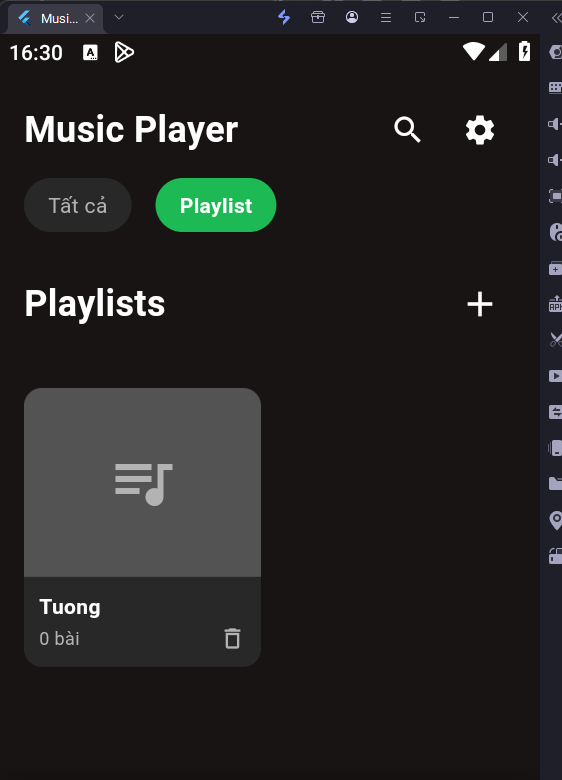
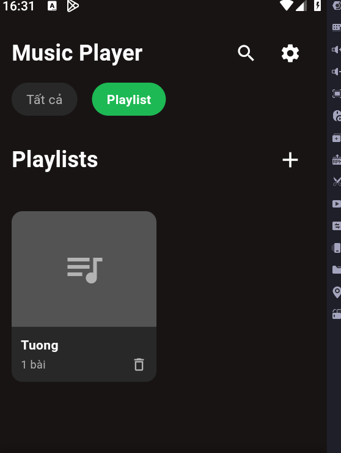
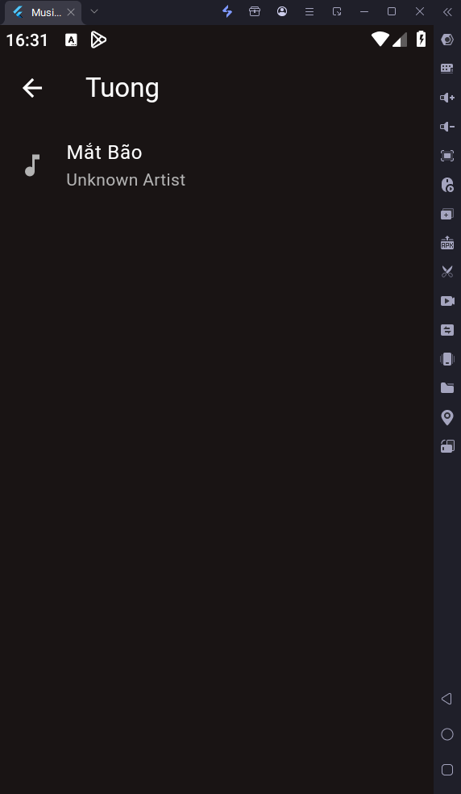
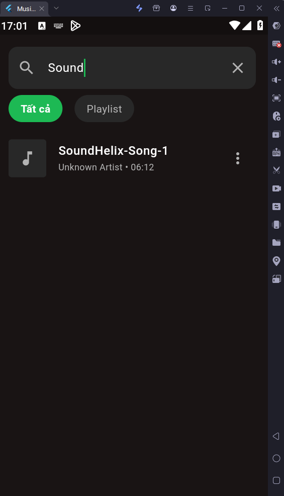
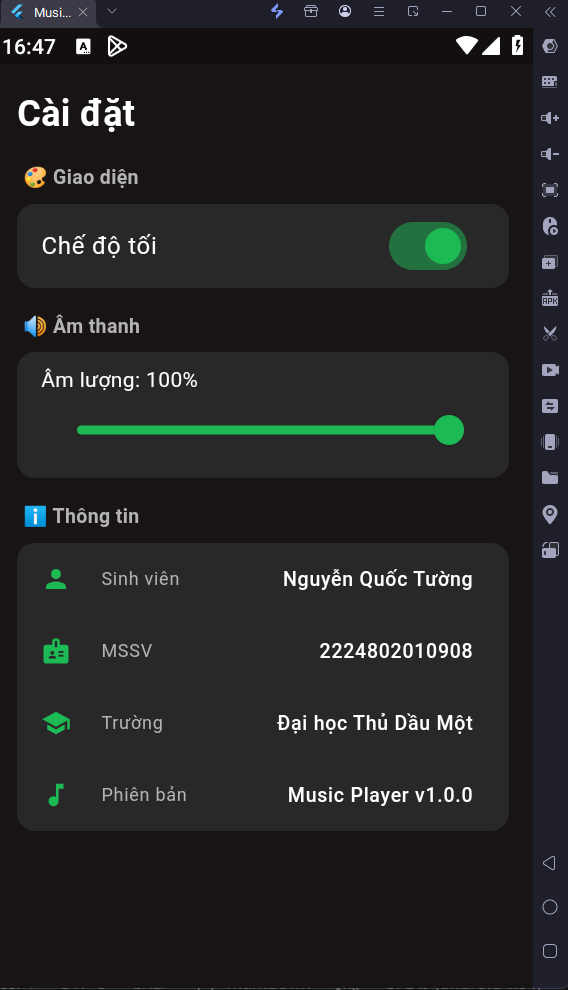

# 🎵 Offline Music Player - Lab 6

<div align="center">


**A fully functional offline music player built with Flutter**

</div>

---

##  Thông tin sinh viên

| Field | Info |
|---|---|
| **Sinh viên** | Nguyễn Quốc Tường |
| **MSSV** | 2224802010908 |
| **Môn học** | Phát triển ứng dụng đa nền tảng |
| **Trường** | Đại học Thủ Dầu Một |
| **GitHub** | [QuocTuongM](https://github.com/QuocTuongM) |

---

##  Screenshots

###  Home Screen - Danh sách nhạc



###  Now Playing Screen




### ⬇️ Mini Player



###  Playlist Screen
<!-- 📸 CHỤP: Bấm tab Playlist, tạo 1 playlist rồi chụp -->
<!-- LƯU FILE: screenshots/playlist_screen.png -->






###  Search Screen



###  Settings Screen




---

## ✨ Tính năng

### Core Features
-  **Music Library** - Đọc tất cả bài hát từ thiết bị
-  **Playback Controls** - Play, Pause, Next, Previous
-  **Shuffle Mode** - Phát ngẫu nhiên
-  **Repeat Modes** - Lặp tất cả / Lặp 1 bài / Tắt lặp
-  **Progress Bar** - Seek đến vị trí bất kỳ
-  **Volume Control** - Điều chỉnh âm lượng
-  **Playlist Management** - Tạo, xóa, quản lý playlist
-  **Search** - Tìm kiếm theo tên bài / nghệ sĩ
-  **Mini Player** - Player thu nhỏ ở dưới màn hình
-  **Persistence** - Lưu trạng thái phát, shuffle, repeat, volume

---

##  Cấu trúc Project

```
lib/
├── main.dart
├── models/
│   ├── song_model.dart          # Model bài hát
│   ├── playlist_model.dart      # Model playlist
│   └── playback_state_model.dart # Model trạng thái phát
├── services/
│   ├── audio_player_service.dart # Service phát nhạc
│   ├── storage_service.dart      # Lưu dữ liệu local
│   ├── permission_service.dart   # Xin quyền
│   └── playlist_service.dart     # Đọc nhạc từ thiết bị
├── providers/
│   ├── audio_provider.dart       # State management nhạc
│   ├── playlist_provider.dart    # State management playlist
│   └── theme_provider.dart       # State management theme
├── screens/
│   ├── home_screen.dart          # Màn hình chính
│   ├── now_playing_screen.dart   # Màn hình đang phát
│   ├── playlist_screen.dart      # Màn hình playlist
│   ├── all_songs_screen.dart     # Tất cả bài hát
│   └── settings_screen.dart      # Cài đặt
├── widgets/
│   ├── song_tile.dart            # Item bài hát
│   ├── mini_player.dart          # Mini player
│   ├── player_controls.dart      # Nút điều khiển
│   ├── progress_bar.dart         # Thanh tiến trình
│   ├── playlist_card.dart        # Card playlist
│   └── album_art.dart            # Ảnh album
└── utils/
    ├── constants.dart            # Màu sắc & strings
    ├── duration_formatter.dart   # Format thời gian
    └── color_extractor.dart      # Trích xuất màu từ ảnh
```

---

##  Thư viện sử dụng

| Package | Version | Mục đích |
|---|---|---|
| `just_audio` | ^0.9.36 | Phát nhạc |
| `on_audio_query` | ^2.9.0 | Đọc nhạc từ thiết bị |
| `audio_service` | ^0.18.12 | Background playback |
| `provider` | ^6.1.1 | State management |
| `shared_preferences` | ^2.2.2 | Lưu dữ liệu |
| `permission_handler` | ^11.1.0 | Xin quyền |
| `rxdart` | ^0.27.7 | Reactive streams |
| `palette_generator` | ^0.3.3+3 | Trích xuất màu album art |
| `path_provider` | ^2.1.1 | Đường dẫn thiết bị |
| `file_picker` | ^6.1.1 | Chọn file |

---

##  Hướng dẫn chạy

```bash
# 1. Clone repository
git clone https://github.com/QuocTuongM/TH_Flutter.git

# 2. Vào thư mục lab_6
cd TH_Flutter/lab_6

# 3. Cài dependencies
flutter pub get

# 4. Chạy app (cần thiết bị thật hoặc LDPlayer)
flutter run
```

### ⚠️ Lưu ý quan trọng
- App **bắt buộc chạy trên thiết bị thật hoặc LDPlayer**
- Không hỗ trợ chạy trên Chrome/Web
- Cần cấp quyền **Storage** khi lần đầu mở app
- Thêm file nhạc (.mp3, .m4a, .flac) vào thiết bị trước khi chạy

###  Cách thêm nhạc vào LDPlayer
1. Mở LDPlayer
2. Kéo thả file `.mp3` vào cửa sổ LDPlayer
3. File sẽ được lưu vào `/sdcard/Music/`
4. Mở app và kéo refresh để tải lại danh sách

---

##  Design Specifications

| Element | Value |
|---|---|
| Primary Color | `#1DB954` (Spotify Green) |
| Background | `#191414` (Dark) |
| Surface | `#282828` (Card) |
| Text | `#FFFFFF` (White) |
| Subtitle | `#B3B3B3` (Grey) |

---

##  Known Limitations

- GPS không áp dụng, chỉ đọc nhạc từ local storage
- Background playback cần thiết bị thật
- Album art chỉ hiển thị nếu file nhạc có metadata
- iOS build cần macOS + Xcode

---

## 🔮 Future Improvements

- Equalizer
- Sleep timer
- Lyrics display
- Crossfade between tracks
- Dynamic theme theo album art
- Share bài hát
- Thống kê nghe nhạc

---